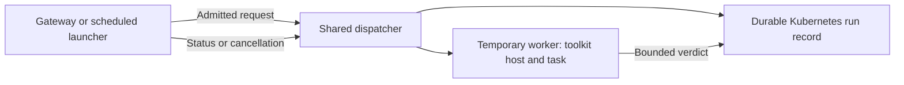

# Jobs in their own runtime image

A job can run once in a temporary Kubernetes worker without putting Python, a compiler,
or its credentials in the chat image. The existing executable/argv/environment/verdict
contract is unchanged. Local jobs omit `worker` and continue to run as before.

The first supported target is the toolkit Helm chart on Kubernetes 1.34 or newer, with
native Kubernetes Secret references. A shared dispatcher runs **per agent, across its
jobs**. The gateway and scheduled launchers perform the existing admission checks; the
dispatcher owns durable execution and creates the worker. No per-task service is needed.



## Minimal Python job

Build [the example image](../deploy/helm/examples/worker/Dockerfile) from the **same toolkit
release** as the gateway, push it, and use its published digest:

```sh
docker build --build-arg TOOLKIT_IMAGE=ghcr.io/sageox/agent-base@sha256:<toolkit-digest> \
  -t registry.example/tasks:reviewed deploy/helm/examples/worker
docker push registry.example/tasks:reviewed
```

Declare the job in `agent.yaml`. Replace the placeholder with the real 64-character digest.
The optional parameter is delivered as `JOB_PARAM_NUMBER`, never interpolated into argv.

```yaml
jobs:
  - slug: positive-number
    archetype: queue
    description: Check a positive integer in a Python worker.
    trigger: {onRequest: true}
    budget: {wallClockMs: 60000, deadlineHeadroomMs: 5000}
    worker:
      image: registry.example/tasks@sha256:<worker-digest>
      directory: /work
    parameters:
      number: {type: integer, minimum: 1, description: Number to check.}
    run:
      command: python3
      args: [task.py]
      # Optional; provision this separately, only if the task needs it.
      # jobSecrets: {API_TOKEN: TASK_TOKEN}
```

Add the following to this agent's existing chart values. The chart mirrors the trigger,
budget and deployment identity; the image and executable stay in the reviewed manifest.
Provision `task-worker` as a separate ServiceAccount with no Kubernetes RBAC grants. Create
`dispatcher-auth` as a Secret whose `token` key contains at least 32 random characters.
Keep that token out of the agent bundle, brain configuration, and tool policy.

```yaml
agents:
  demo:
    dispatcher: {tokenSecret: dispatcher-auth}
    jobs:
      - slug: positive-number
        suspend: false
        trigger: {schedules: [], timezone: UTC}
        budget: {wallClockMs: 60000, deadlineHeadroomMs: 5000}
        worker:
          serviceAccountName: task-worker
          resources:
            requests: {cpu: 100m, memory: 128Mi}
            limits: {cpu: "1", memory: 512Mi}
          # Map only references declared in run.secrets or run.jobSecrets.
          # secrets:
          #   TASK_TOKEN: {name: task-credentials, key: api-token}
```

Run `sageox-agent mcp add jobs` to install the jobs tool policy. `job_run` takes only `job`
and declared `params`. Image, command, credential overrides and fabricated `human` or
`approved` fields are rejected. External runs return an ID promptly. Use `job_status` with
`{job, runId}` for the result; `job_cancel` requests termination. These tools have independent
policy entries: `mcp__jobs__job_status` and `mcp__jobs__job_cancel`.

To automatically post failures and their error explanations, add a report to the job:

```yaml
report:
  surface: slack       # or buzz, using that surface's channel identifier
  channel: C0123456789
  # announce: always   # optional: also announce successful runs
```

The gateway or scheduled launcher posts through the existing channel guards. A failed or
UNKNOWN run includes its exit/failure details and a redacted error excerpt: the last 1,600
characters of stderr, or stdout if stderr is empty. Known worker states such as `OOMKilled`
are included when available. Requested runs also include that explanation in the reply to
the conversation that started them, even when no separate `report` destination is configured.
No manual command, script change, or SDK is needed for this notification.

The excerpt is quoted as job output, not interpreted by the brain. Partial checkpoints and
omitted earlier output are labelled. If no output survived, or the diagnostic lookup fails,
the failure notice still posts and says the extra output is unavailable. Reporting is best-effort;
the durable run ID remains the way to retrieve a result if a chat post cannot arrive.

An operator can also use `sageox-agent job status <slug> --run-id <id>` or `job cancel` with
the same arguments. Outside chart-managed Pods, set `AGENT_JOB_DISPATCHER_URL` and
`AGENT_JOB_DISPATCHER_TOKEN` for that CLI process. An external declaration on an unsupported
deployment fails explicitly; it never falls back to running inside the gateway.

## Images, sources and credentials

The compatible image retains `/app/bin/sageox-agent`, Node and the toolkit dependencies.
It supports UID/GID 10001 and a writable temporary directory and `/dev/termination-log`.
The dispatcher invokes `sageox-agent job worker`; the host invokes the declared executable
without a shell. A compiled Rust or C binary works by changing `run.command` to its path,
with the same verdict artifact as Python. A missing runtime or incompatible host produces
an unsuccessful or unknown run, never an automatic fallback or replay.

Source is **baked into the digest-pinned worker image**. `worker.directory` selects its
working directory. No gateway bundle files, mutable repository checkout, shared PVC, or
local index are inherited. Mount injection and arbitrary third-party images are outside
this initial contract. `report.probe` is rejected for external workers because their hosts
do not hold channel credentials. The gateway can still post ordinary job results.

The worker receives only the secret references its manifest declares, selected individually
from its profile and projected into its host's environment. Neither gateway nor dispatcher
mounts these values. The worker body receives only the existing declared environment
envelope. Do not place task credentials in `agents.<name>.secrets`, a gateway `.env`, or
the Terraform module's gateway secret list.

The chart gives **only the dispatcher** permission to create Jobs and maintain run
ConfigMaps, and create per-run claim Secrets owned by their worker Jobs. Run ConfigMaps
contain only a token hash; the claim Secret is projected into that worker and garbage-collected
with its Job. The dispatcher cannot read Secrets directly, but creating workloads is privileged: keep
its identity and API capability outside the brain. Gateway and workers do not mount a
Kubernetes API token. A worker has its own ServiceAccount; the chart rejects reuse of the
gateway or dispatcher accounts and Kubernetes Secret objects across every agent in the
release. Accounts and credentials provisioned outside this release still require an
operator to check their permissions.

Install the release in a **dedicated namespace** (for example, `helm install agents
./deploy/helm --namespace agent-workloads --create-namespace ...`). This namespace is the
trust boundary: Kubernetes RBAC cannot constrain Job or ConfigMap creation by label or
name prefix. Dispatchers in one namespace must be mutually trusted; deploy mutually
untrusted agents in separate releases and namespaces, with appropriately scoped cloud
identities and admission policy. Application ownership labels prevent accidental collisions,
but do not isolate a compromised dispatcher from other workloads in its namespace.

A distinct ServiceAccount is not sufficient if cloud identities share permissions. When
adding IRSA, EKS Pod Identity or another cloud integration, provision a separate worker
role and ensure the gateway cannot retrieve its credentials, assume that role, create
workloads, read run ConfigMaps, or exec into workers. Worker cloud identity is consumer
provisioning; the Terraform gateway module does not provision it. Apply cluster admission
and network policies appropriate to your namespace. Allow gateway/launcher-to-dispatcher
and worker-to-dispatcher TCP 8090, and dispatcher-to-Kubernetes API access. Existing
gateway NetworkPolicy values do not automatically apply to dispatcher/worker Pods.

## Triggers and lifecycle

For a job supporting both requests and schedules, add schedules and a kill switch in its
manifest and mirror the schedules in chart values. CronJobs still invoke the toolkit host,
which dispatches the **same** worker declaration. Scheduled launcher Pods have no worker
credential mounts or Kubernetes token. A request-only job needs no fake schedule or switch.
The existing owner-derived human bypass applies only to automation posture; domain safety
checks in the body remain its responsibility. No new approval workflow is introduced.

Run IDs are backed by ConfigMaps, independent of gateway/dispatcher restarts. Repeating the
same job and inputs within the same inbound message reuses an ID; use a new message for a
new intentional execution. Scheduled launcher replacements use the scheduling Job's UID.
Atomic ConfigMap creation and resource-version updates serialize workers across processes
and across triggers. Overlap is refused, not queued.

Each admission stores the reviewed job and its worker identity, secret references and
resource limits. A dispatcher restart or profile update cannot change an admitted run's
configuration. The values of referenced Secrets remain managed by Kubernetes; rotating a
Secret before a worker starts changes the value it receives.

If claim Secret creation is rejected or its response is lost, the dispatcher requests
cancellation and reports that dispatch failure as UNKNOWN without retrying execution.
The first durable stop reason is retained when cancellations race. Cleanup removes any
resulting worker before releasing its overlap lock. If the Kubernetes API cannot persist
cancellation, the run remains uncertain: an already admitted worker may still execute
once. A failed cancellation write is never reported as a finished or stopped run.

Before running its body, a worker claims that run once through the dispatcher. Replacement
Pods cannot claim it again. A lost claim response can prevent execution; it never authorizes
a second attempt. A lost dispatch response may leave a run uncertain through its deadline;
the dispatcher never retries a potentially completed mutation. Consumer-specific
idempotency and reconciliation are still required for external effects.

The budget starts at admission, including time waiting for a Pod. The host sends SIGTERM
at the remaining wall-clock budget and SIGKILL at its deadline; the Kubernetes Job has a
matching active deadline and no retries. Cancellation deletes the actual Job and waits for
termination before releasing overlap protection. `cancelling` is not a completed
cancellation. Cancellation cannot undo side effects, and a chat timeout cannot decide the
worker's outcome.

Ordinary model-facing status contains host-minted outcome, process execution facts, and
PASS/FAIL/UNKNOWN gate counts. Declared structured answers require the explicit read below.
Raw logs, gate names, gate details and exception text are **never returned through jobs MCP**.
The gateway separately attaches the bounded redacted error
excerpt to automatic chat reports. The artifact read is capped at 64 KiB; the worker's summary fits Kubernetes'
4 KiB termination message. A missing/corrupt result, interrupted execution or lost worker
is UNKNOWN, even if a container exited zero. A process that exits nonzero with a readable
host result retains the existing FAIL verdict semantics.

An uncaught script exception that exits nonzero therefore produces FAIL, even if the
script never writes an artifact. The lifecycle outcome can still be `completed`: it means
the process finished, while the verdict says whether it succeeded. A zero exit without a
valid, nonempty verdict artifact is UNKNOWN.

The default model-facing result is a verdict summary. Script-written
`detail` fields are stripped at the worker boundary. Automatic error reports use captured
stderr/stdout; the larger diagnostic archive is retained separately for deeper debugging.

The dispatcher copies the bounded result to the run record **before** deleting the Job.
Results remain retrievable for seven days. Afterwards the record becomes an UNKNOWN
tombstone and cannot be replayed under that ID. Tombstones remain until an operator removes
them; deleting them also removes duplicate protection for those historical requests.
Back up run ConfigMaps if recovering across loss of the cluster is required. A gateway
restart may lose its in-flight chat reply callback; status retrieval remains authoritative.

## Structured answers

An external job can return a lookup, report or proposed change by declaring:

```yaml
output: {format: json}  # alongside worker, run, trigger and budget in the job declaration
```

Omitting this field preserves verdict-only exposure. The host sets
`JOB_OUTPUT_SCHEMA_VERSION=1` and `JOB_OUTPUT_MAX_BYTES=16384` for opted-in jobs;
both are empty otherwise. An older host may omit them entirely. Check for the exact
supported version **before** writing an output section: older strict artifact readers
reject unknown fields. Use the same toolkit release in the worker and dispatcher.

The existing `JOB_VERDICT_PATH` file gains one optional, versioned section:

```json
{
  "gates": [{"gate": "lookup", "executed": true, "exitCode": 0}],
  "output": {"version": 1, "data": {"records": [{"id": 42, "title": "Found record"}]}}
}
```

`data` is any JSON value, including `null`, with at most 32 nested container levels.
The toolkit validates the envelope and bounds; the consumer validates domain fields and
interprets the answer. Unknown envelope fields, unsupported versions, non-finite numbers
and invalid UTF-8 are rejected. Output and gates are validated independently. A malformed
output section preserves valid gates; an unreadable or malformed whole file cannot prove
either section. Host fields such as `outcome`, `counts` and `approved` have no authority
inside `data`, and cannot be added to the artifact envelope.

A Python producer needs only the standard library:

```python
import json
import os

artifact = {"gates": [{"gate": "lookup", "executed": True, "exitCode": 0}]}
if os.environ.get("JOB_OUTPUT_SCHEMA_VERSION") == "1":
    # Explicitly select fields intended for the caller, rather than returning a raw API response.
    artifact["output"] = {"version": 1, "data": {"records": [{"id": 42}]}}
path = os.environ["JOB_VERDICT_PATH"]
with open(path + ".tmp", "w", encoding="utf-8") as stream:
    json.dump(artifact, stream, ensure_ascii=False, allow_nan=False)
os.replace(path + ".tmp", path)
```

A compiled executable uses `getenv("JOB_OUTPUT_SCHEMA_VERSION")`, writes the same JSON
bytes to `getenv("JOB_VERDICT_PATH")`, closes the file and exits. No toolkit SDK or
stdout convention is required. Write a temporary file and rename it when complete.
The host reads after process termination; a signalled, interrupted or timed-out process
cannot publish its artifact as a complete answer, even if it left syntactically valid JSON.
A normal nonzero exit may return an answer while its process gate remains FAIL.

For chat retrieval, call the existing tool with:

```json
{"job": "positive-number", "runId": "<run ID>", "includeOutput": true}
```

`job_status` returns `output: {state: "available", value: {version: 1, data: ...}}` when
authorized. Without `includeOutput`, it returns availability alone. `job_cancel`,
automatic reports/replies, termination messages and lifecycle observers never carry
the application payload. Operators can explicitly retrieve it using
`sageox-agent job status <slug> --run-id <id> --output` with the gateway's dispatcher
credential. Scheduled runs and runs launched by the operator CLI have no chat reader;
their output is available through this operator path.

| Output state | Meaning |
| --- | --- |
| No `output` field | This run did not declare an answer, or predates this capability. |
| `pending` | Execution has not settled; no complete answer is exposed. |
| `available` | The finalized answer was stored durably. The value requires an authorized read. |
| `missing` | The process finished without an output section or artifact. |
| `invalid` | The envelope, JSON or artifact is unusable. |
| `oversized` | The answer or artifact exceeded its byte bound. Nothing was truncated. |
| `interrupted` | The process was stopped; its artifact cannot establish a complete answer. |
| `blocked` | A known credential was found; the entire answer was withheld. |
| `unavailable` | No final publication arrived, or the stored answer cannot be read. |
| `expired` | Seven days have elapsed since settlement. |

Execution outcome, gate verdict and output availability are independent. An unavailable
answer does not prove that an operation failed or had no effects. An available answer
does not prove success: the worker host or its termination summary may still be lost.
Do not rerun a mutation to recover an answer. The worker retries delivery of the identical
final publication once on a transient failure, without reclaiming or executing the job.

The complete output envelope, serialized as compact UTF-8 JSON, is limited to **16 KiB**.
The artifact file is limited to **64 KiB**, and the worker publication and status response
each have a **20 KiB** transport bound. The model-facing status text is also capped at
20 KiB; JSON quoting in the MCP wrapper can use up to twice that plus its small protocol
envelope. These limits count bytes, not characters. No layer silently truncates an answer.

The worker sends the final publication through its authenticated, run-scoped dispatcher
connection. The dispatcher stores it in a separate `output` key in the existing run
ConfigMap, with an immutable publication digest, before advertising availability at
settlement. Identical publications are idempotent while the worker capability remains
valid; a different publication conflicts. Workers cannot publish for other admitted runs.
Cleanup removes the worker capability, not the answer. Answers survive gateway and
dispatcher restarts, expire with diagnostics after seven days, and leave an expiration
tombstone. Reads enforce expiration even before the reconciler removes the retained bytes.

The existing `mcp__jobs__job_status` policy must allow the tool. For payload reads, the
gateway additionally requires one attributable live turn matching the requesting author,
surface, channel and original thread, within this agent. It saves that audience at admission
and rechecks it before returning data. A run ID alone grants no access, and the model
cannot supply an audience, operator override or approval flag. Continue retrieval in the
original message thread; a new top-level conversation is a different audience. Status
and cancellation permissions do not automatically include the payload in their responses.

The host rejects output containing known declared credential values or its worker
capability, checking decoded keys and string values too. It withholds the answer whole
instead of editing a potentially actionable plan. This cannot detect every disclosure:
transformed or dynamically acquired credentials and sensitive business data may remain.
Producers own field selection and consumer authorization. Restrict ConfigMap access as
for private diagnostics. This boundary controls retrieval; it does not isolate a shared
brain's memory or certify future uses of data it has already read. Normal outbound messages
still pass the existing channel and leak guards. JSON data never supplies human approval.

Local jobs continue to use the same artifact parser and gate semantics. An embedded
`JobHost` can collect opted-in local output through `onOutput(runId, output)`, separate
from `onRun`; durable `job_status` retrieval in this release requires an external worker.
This extends the existing file contract without introducing another producer file or
implementing the separate lifecycle/work-reporting capability proposed in #53.

## Retained diagnostics

No script changes or SDK are needed. The worker host captures stdout and stderr, retaining
the last **8 KiB of each stream**, and records the process exit code, signal, execution
state, and timestamps. The dispatcher adds the reviewed image digest and worker Pod facts
before cleanup. `truncated: true` means earlier output was discarded. Full redacted output
also goes to the Pod's normal log streams for the deployment's existing log collector.

The host removes known declared credential values and its run capability before forwarding
or retaining output. Redaction spans stream chunks and precedes truncation. Credentials
that the script encodes, abbreviates, or otherwise transforms, dynamically obtained
credentials, and other sensitive business data may remain, so these
logs are still private operator data. Restrict ConfigMap read access in the agent namespace;
neither the gateway nor the brain needs that access.

Checkpoints are sent once a second and after process termination through a **write-only,
run-scoped** capability. A finished host attempts to persist its final checkpoint before
exiting. Cancellation, a killed worker, or an unavailable dispatcher may leave only the last
checkpoint; `complete: false` explicitly marks that limitation. If the host never starts,
the record still identifies the image and any observed Pod state, such as `ImagePullBackOff`.
A diagnostic checkpoint never substitutes for a missing verdict or authorizes a replay.

`job_status` returns safe process facts and `diagnostics: {ref, complete}`. Chat reports
automatically include the failure class or exit code, the redacted error excerpt, and that
reference. The gateway retrieves the excerpt through its authenticated `/failure-report`
endpoint, which returns at most 2,000 characters and is not exposed through MCP. It sends
the text directly through the existing guarded report/reply path, without attaching it to
model-facing run records.

The full diagnostic archive remains operator-only. The following command is **optional
for deeper debugging**, not required to receive failure explanations:

```sh
sageox-agent job diagnostics run-<40-character-reference> \
  --namespace agents --context operator-context
```

Use the exact `diagnostics.ref` from status, which differs from the run ID. This command
requires `kubectl` and permission to read the referenced ConfigMap; it uses the current
Kubernetes context if `--context` is omitted. It does not require an agent bundle or a
dispatcher bearer token. The returned JSON includes `stdout`, `stderr`, process facts,
the image digest, and observed worker Pod facts.

Diagnostics and results expire together seven days after the run finishes. Deleting a
worker does not delete either record. Loss of a node or dispatcher connectivity can lose
the final unacknowledged log tail; durable checkpoints remain available across restarts.

See the Kubernetes documentation for [Job lifecycle and deadlines](https://kubernetes.io/docs/concepts/workloads/controllers/job/)
and [optimistic concurrency](https://kubernetes.io/docs/reference/using-api/api-concepts/#resource-versions).
